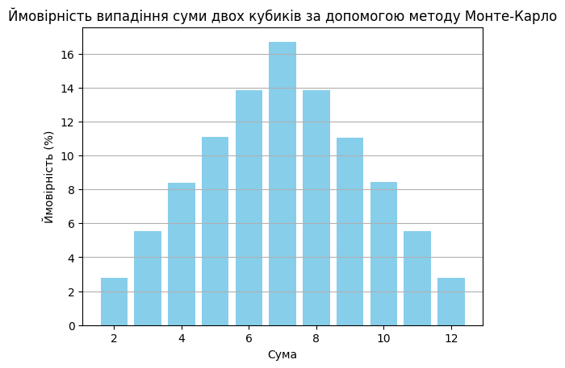

# Симуляція Монте-Карло для кидків кубиків

## Огляд

Цей проєкт симулює кидання двох кубиків мільйон разів для визначення ймовірності кожної можливої суми (від 2 до 12) за допомогою методу Монте-Карло. Результати симуляції порівнюються з аналітичними ймовірностями.

## Результати

Нижче наведена таблиця ймовірностей та частот для кожної можливої суми на основі симуляції:

| Сума | Ймовірність | Частота            |
|------|-------------|--------------------|
| 2    | 2.79%       | (27859/1000000)    |
| 3    | 5.57%       | (55707/1000000)    |
| 4    | 8.34%       | (83439/1000000)    |
| 5    | 11.09%      | (110935/1000000)   |
| 6    | 13.90%      | (138987/1000000)   |
| 7    | 16.62%      | (166152/1000000)   |
| 8    | 13.91%      | (139054/1000000)   |
| 9    | 11.10%      | (111048/1000000)   |
| 10   | 8.38%       | (83752/1000000)    |
| 11   | 5.54%       | (55358/1000000)    |
| 12   | 2.77%       | (27709/1000000)    |

## Графічне представлення

Стовпчаста діаграма вище показує ймовірності для кожної можливої суми двох кубиків, обчислені за допомогою методу Монте-Карло.

## Порівняння з аналітичними результатами

Аналітичні ймовірності для сум двох шестигранних кубиків добре відомі. Результати, отримані за допомогою симуляції Монте-Карло, тісно відповідають цим теоретичним ймовірностям, з деякими невеликими відхиленнями через випадковість симуляції.

Сума 7 має найбільшу ймовірність, тоді як суми 2 і 12 мають найменші ймовірності, що узгоджується з аналітичними очікуваннями.

## Висновок

Метод Монте-Карло надає точну оцінку ймовірностей для кожної можливої суми двох кубиків. При великій кількості симуляцій (1,000,000 кидків) результати дуже близькі до теоретичних значень, що демонструє ефективність підходу Монте-Карло для моделювання випадкових процесів.
